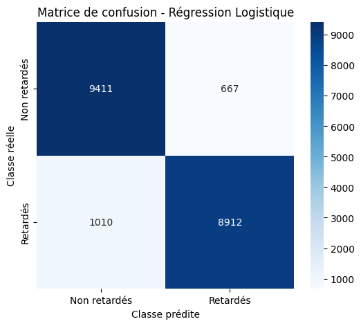
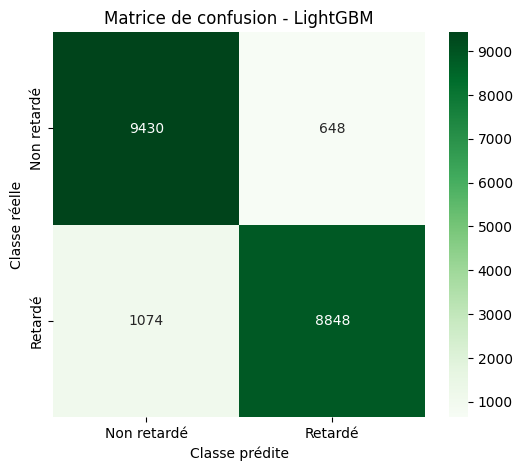

# Prédiction des retards d'avion
### Soutenance "Concevoir et Implémenter une Solution IA"
#### Marion Roussel

---
transition: slide-left
layout: quote
hideInToc: true
---
# Marion Roussel
- 🩺 - **Infirmière** de formation  
  
- 🌐 - **Reconvertion** dans le développement web

- 👩🏼‍💻 - **Développeuse full-stack** intermédiaire

- 📊 - Intérêt pour la **donnée** et l'**IA**

<!--
Marion Roussel
Infirmière de formation, reconvertie autodidacte dans le développement web depuis 3 ans et demi.
J'occupe actuellement un poste de développeuse full-stack intermédiaire, au sein de l'équipe Produit d'une entreprise de e-santé.
Mon parcours m'a obligé à prendre des raccourcis et m'a rendu moins généraliste que d'autre profil. Mais je m'efforce de combler ces angles morts par de la formation continue.
Dans ce contexte, la donnée et l'IA ont toujours attisées ma curiosité mais me semblaient innaccessibles, voilà ce qui m'a amené à suivre cette formation.
-->

---
transition: slide-left
layout: intro
hideInToc: true
---
# Soutenance
Dans le cadre de cette formation, nous avons dû travailler sur un jeu de données concernant les **retards d'avion** aux États-Unis.  
Nous devions l'**analyser**, le **traiter**, l'utiliser pour créer un **modèle de prédiction des retards** et intégrer tout cela dans une **application** maintenable et robuste.

---
layout: image-right
image: "assets/pictures/photo-1504150558240-0b4fd8946624.avif"
hideInToc: true
---

# Table des matières
<Toc minDepth="1" maxDepth="2" class="text-sm"/>

---
level: 1
transition: slide-left
layout: image-left
image: "assets/pictures/premium_photo-1677281438593-0daee23b3bc7.avif"
---
# Le contexte
- 🛫 ~ 19% de vols retardés en 2019 aux États-Unis
  
- 💸 28 milliards de dollars de perte

- 🚨 enjeu majeur pour les compagnies aériennes

- 🔀 multifactoriel et complexe  
<br/>
<br/>
=> 🤖 création d'un modèle de prédiction
<!--
Selon le Bureau of Transportation Statistics des États-Unis, environ 19 % des vols ont été retardés en
2019, engendrant des coûts économiques estimés à 28 milliards de dollars.
Les retards d'avion représentent donc un enjeu majeur pour les compagnies aériennes.
Il s'agit cependant d'un phénomène multifactoriel et complexe, influencé tant par les conditions météorologiques, la congestion du trafic aérien,
des problèmes techniques ou opérationnels.
Dans ce cadre, il nous a été demandé de créer un modèle de prédiction des retards à partir de données historiques du Bureau of Transportation Statistics des États-Unis.
-->

---
transition: slide-left
level: 1
layout: section
image: "assets/pictures/photo-1569154941061-e231b4725ef1.avif"
---
# Les données

<!--
-->

---
transition: slide-left
level: 2
layout: section
layout: image-right
image: "assets/pictures/premium_photo-1681586533774-1d9d42425712.avif"
---
<p class="text-xs text-blue-300">Les données ⸱ Description</p>


# Description du jeu de données
<br/>

> Données issues du Bureau of Transportation Statistics des États-Unis

<br/>

- 12 fichiers `.csv` de 147 à 175Mo
  
- un fichier par mois de l'année 2016
- chaque fichier compte plus de 450 000 lignes
- total ~ 5,6 millions de lignes

<!--
-->

---
transition: slide-left
level: 2
layout: image-left
image: "assets/pictures/premium_photo-1661340638286-7ce343262c4c.avif"
---
<p class="text-xs text-blue-300">Les données ⸱ Les difficultés</p>

# Les difficultés
- Taille du jeu de données 
  - problèmes récurrents de RAM
  
  - librairies vues en formation, inadaptées au volume
- Jeu de données moins propre
  - plus de traitement
  
  - plus d'hypthèses à tester

<!--
Pour traiter ce jeu de données, j'ai été confrontée à plusieurs difficultés. Je n'avais notamment jamais travaillé avec un jeu de données d'une telle ampleur. Lorsque j'ai découvert les données pour la première fois, j'avais anticipé ces difficultés, mais elles ont été plus contraignantes qu'anticipé. J'ai régulièrement été confrontée à des problèmes de RAM, avec, au choix, mon éditeur ou mon PC qui s'éteignait intempestivement. J'ai malheureusement découvert, trop tard, la librairie de Polars.
Par ailleurs, le jeu de données était moins propre que les jeux avec lesquels nous avons travaillé durant la formation. Cela est sans doute plus représentatif des données du monde réel, mais cela m'a demandé une analyse et un traitement plus approfondis que ce que j'avais pu faire durant la formation. Notamment concernant les données manqueantes pour lesquelles j'ai dû élaborer des hypothèses qu'il a fallu tester. 
-->  

---
transition: slide-left
level: 2
---
<p class="text-xs text-blue-300">Les données ⸱ L'analyse</p>

# L'analyse

<!--
-->

---
transition: slide-left
layout: section
level: 1
---
# Le modèle
### Classification binaire

<!--
Dans notre contexte, il s'agit de prédire si, en fonction de certaines informaitons, un vol sera ou non en retard. En terme de modèle, il s'agit d'un problème de classification binaire. Pour ce faire, j'ai choisi de me concentrer sur 3 modèles différents afin de les comparer et de choisir le meilleur des 3.
-->

---
transition: slide-left
layout: two-cols-header
level: 2
---
<p class="text-xs text-blue-300">Le modèle ⸱ Les modèles en compétition</p>

# Les modèles en compétition

::left::
- Diversité des approches
- Complémentarité
- Robustesse
- Standards de l'industrie

::right::
### 📈 Logistic Regression
Modèle linéaire simple et interprétable.

### 🌳 Random Forest
Méthode d'ensemble qui combine de multiples arbres de décision entraînés sur des échantillons différents du dataset.

### 🤖 LightGBM
Algorithme de boosting gradient optimisé pour la vitesse et l'efficacité mémoire.

<!--
# Les modèles en compétition
- Diversité des approches : Modèle linéaire (Logistic Regression), ensemble d'arbres (Random Forest), et boosting gradient (LightGBM)
- Complémentarité : Du plus simple au plus complexe, du plus ancien au plus moderne, permettant d'évaluer si la complexité apporte un gain de performance
- Robustesse : Couvrent différents types de relations dans les données (linéaires vs non-linéaires)
- Références : Standards de l'industrie avec des performances reconnues

## Logistic Regression
Modèle linéaire simple et interprétable qui estime la probabilité d'appartenance à une classe via la fonction logistique. Rapide à entraîner et efficace sur des relations linéaires, il sert souvent de baseline pour évaluer des modèles plus complexes.

## Random Forest
Méthode d'ensemble qui combine de multiples arbres de décision entraînés sur des échantillons différents du dataset. Robuste au surapprentissage et capable de capturer des relations non-linéaires complexes, il offre également une bonne interprétabilité via l'importance des features.

## LightGBM
Algorithme de boosting gradient optimisé pour la vitesse et l'efficacité mémoire, utilisant une approche leaf-wise pour construire les arbres. Particulièrement performant sur de gros datasets, il excelle dans la capture de patterns complexes tout en étant moins susceptible au surapprentissage que d'autres méthodes de
-->

---
transition: slide-left
layout: image-right
image: "assets/pictures/photo-1670926774123-4e36ed8f5fd1.avif"
level: 2
---
<p class="text-xs text-blue-300">Le modèle ⸱ La préparation des données</p>

# Préparation des données
- split des données
- traitement des valeurs numériques :
  - imputation -> **SimpleImputer**
  - normalisation et standardisation -> **StandardScaler**
- traitement des valeurs catégorielles
  - imputation -> **SimpleImputer**
  - encodage -> **OneHotEncoder**


---
transition: slide-left
level: 2
---
<p class="text-xs text-blue-300">Le modèle ⸱ La cross-validation</p>

# La cross-validation
- Intégration de la pipeline complète (prétraitement + modèle)
- GridSearchCV

<!--
-->

---
transition: fade
layout: image-left
image: "assets/pictures/photo-1664854953181-b12e6dda8b7c.avif"
level: 3
---
<p class="text-xs text-blue-300">Le modèle ⸱ La cross-validation ⸱ Logistic Regression</p>

# Logistic Regression

```python
param_grid = {
    "C": [0.01, 0.1, 1, 10, 100],
    "penalty": ["l1", "l2"],
    "solver": ["liblinear", "saga"],
    "class_weight": ["balanced", None],
}
```
<p class="text-sm">

- Paramètre C (Régularisation) : 1

- Penalty (Type de régularisation) : l2

- Solver (Algorithme d'optimisation) : saga

- Class_weight (Gestion du déséquilibre) : None

Meilleur score CV Logistic Regression : 0.9118
</p>


<!--
Paramètre C (Régularisation)
C contrôle l'inverse de la force de régularisation
-Valeurs faibles (0.01, 0.1) = forte régularisation → prévient le surapprentissage
-Valeurs élevées (10, 100) = faible régularisation → modèle plus complexe
-Progression logarithmique couvre efficacement l'espace des paramètres

Penalty (Type de régularisation)
- L1 (Lasso) : sélection automatique de features, peut mettre des coefficients à zéro
- L2 (Ridge) : réduction uniforme des coefficients, garde toutes les features
- Teste deux approches complémentaires de régularisation

Solver (Algorithme d'optimisation)
- liblinear : efficace pour petits datasets, supporte L1 et L2
- saga : adapté aux gros datasets, convergence rapide, supporte L1 et L2
- Compatibilité avec les différents types de pénalités

Class_weight (Gestion du déséquilibre)
- "balanced" : ajuste automatiquement les poids selon la fréquence des classes
- None : poids égaux pour toutes les classes
- Important pour les datasets déséquilibrés (comme les retards d'avion)
-->

---
transition: fade
layout: image-left
image: "assets/pictures/photo-1664854953181-b12e6dda8b7c.avif"
level: 3
---
<p class="text-xs text-blue-300">Le modèle ⸱ La cross-validation ⸱ Random Forest</p>

# Random Forest
```python
param_grid_rf = {
    "n_estimators": [100, 200, 300],
    "max_depth": [None, 10, 20, 30],
    "min_samples_split": [2, 5, 10],
    "min_samples_leaf": [1, 2, 4],
    "class_weight": ["balanced", "balanced_subsample", None],
}
```
<p class="text-sm">

- N_estimators (Nombre d'arbres) : 200
- Max_depth (Profondeur maximale): 20
- min_samples_split (Échantillons minimum) : 5
- Min_samples_leaf (Échantillons minimum par feuille) : 1
- Class_weight (Gestion du déséquilibre): None
  
Meilleur score CV Random Forest : 0.9018
</p>

<!--
N_estimators (Nombre d'arbres)
- Plus d'arbres = meilleure performance mais temps d'entraînement plus long
- 100 : baseline raisonnable pour tester rapidement
- 200-300 : exploration de l'amélioration avec plus d'arbres
Compromis performance/temps de calcul

Max_depth (Profondeur maximale)
- None : arbres développés jusqu'aux feuilles pures (risque de surapprentissage)
- 10, 20, 30 : limitation de la profondeur pour contrôler la complexité
- Paramètre clé pour éviter le surapprentissage sur des données complexes

Min_samples_split (Échantillons minimum pour diviser)
2 : valeur par défaut, division aggressive
5, 10 : exige plus d'échantillons avant division → arbres moins profonds
Contrôle la granularité des divisions et prévient le surapprentissage

Min_samples_leaf (Échantillons minimum par feuille)
- 1 : feuilles peuvent contenir un seul échantillon (par défaut)
- 2, 4 : force des feuilles plus "peuplées" → généralisation améliorée
- Lisse les prédictions et réduit la variance

Class_weight (Gestion du déséquilibre)
- "balanced" : ajuste les poids selon la distribution globale des classes
- "balanced_subsample" : ajuste les poids pour chaque arbre individuellement
- None : pas d'ajustement de poids
- Essentiel pour les datasets déséquilibrés comme les retards d'avion

Cette grille explore efficacement le compromis biais-variance et la robustesse aux données déséquilibrées.
-->

---
transition: fade
layout: image-left
image: "assets/pictures/photo-1664854953181-b12e6dda8b7c.avif"
level: 3
---
<p class="text-xs text-blue-300">Le modèle ⸱ La cross-validation ⸱ LightGBM</p>

# LightGBM

```python
param_grid_lgbm = {
    "n_estimators": [100, 200, 300],
    "learning_rate": [0.01, 0.1, 0.2],
    "num_leaves": [31, 50, 70],
    "objective": ["binary"],
    "metric": ["binary_logloss"],
}
```

<p class="text-sm">

- N_estimators (Nombre d'estimateurs) : 300
- Learning_rate (Taux d'apprentissage) : 0.1
- Num_leaves (Nombre de feuilles) : 31
- Objective : `binary`
- Metric : `binary_logloss`

Meilleur score CV LightGBM : 0.9110
</p>

<!--
Ce choix d'hyperparamètres pour LightGBM est pertinent car il explore les aspects clés du boosting gradient :

N_estimators (Nombre d'estimateurs)
- Plus d'estimateurs = modèle plus complexe mais risque de surapprentissage
- 100 : baseline rapide pour tester
- 200-300 : exploration de l'amélioration avec plus d'itérations
- Équilibre entre performance et temps d'entraînement

Learning_rate (Taux d'apprentissage)
- 0.01 : apprentissage lent mais stable, nécessite plus d'estimateurs
- 0.1 : valeur par défaut, bon compromis vitesse/stabilité
- 0.2 : apprentissage rapide mais risque d'instabilité
- Contrôle la contribution de chaque arbre au modèle final

Num_leaves (Nombre de feuilles)
- 31 : valeur par défaut, modèle simple
- 50-70 : complexité accrue pour capturer des patterns plus fins
- Paramètre clé de LightGBM (approche leaf-wise vs level-wise)
- Plus de feuilles = modèle plus expressif mais risque de surapprentissage

Objective et Metric
- Objective "binary" : spécifie la tâche de classification binaire
- Metric "binary_logloss" : optimise la log-vraisemblance pour la classification
- Configuration appropriée pour le problème de prédiction des retards

Cette grille explore efficacement le compromis biais-variance spécifique au boosting gradient.
-->

---
transition: slide-left
layout: two-cols-header
level: 2
---
<p class="text-xs text-blue-300">Le modèle ⸱ Les métriques analysées</p>

# Les métriques analysées

::left::
**Precision (Précision)**   
La proportion de prédictions positives faites par le modèle qui sont effectivement correctes.  

`Precision = VP / (VP + FP)`

<br/>
<br/>

**Recall (Rappel ou Sensibilité)**  
La proportion de cas positifs réels que le modèle a correctement identifiés.

`Recall = VP / (VP + FN)`

::right::
**F1-Score**  
La moyenne harmonique de la precision et du recall.

`F1-score = 2 × (Precision × Recall) / (Precision + Recall)`

<br/>
<br/>

**AUC ROC**  
La capacité du modèle à distinguer entre les classes sur l'ensemble des seuils de classification possibles.

<!--
Voici les définitions de ces métriques essentielles pour évaluer les modèles de classification binaire :

## Precision (Précision)
La precision mesure la proportion de prédictions positives qui sont effectivement correctes. Elle répond à la question : "Parmi tous les cas que le modèle a classés comme positifs, combien le sont réellement ?"

**Formule :** Precision = VP / (VP + FP)
où VP = Vrais Positifs, FP = Faux Positifs

## Recall (Rappel ou Sensibilité)
Le recall mesure la proportion de cas positifs réels que le modèle a correctement identifiés. Il répond à la question : "Parmi tous les cas réellement positifs, combien le modèle en a-t-il détectés ?"

**Formule :** Recall = VP / (VP + FN)
où FN = Faux Négatifs

## F1-Score
Le F1-score est la moyenne harmonique de la precision et du recall. Il fournit une mesure équilibrée qui pénalise les modèles ayant une grande différence entre precision et recall.

**Formule :** F1-score = 2 × (Precision × Recall) / (Precision + Recall)

La moyenne harmonique
C'est l'inverse de la moyenne arithmétique des inverses des termes. La moyenne harmonique est donc utilisée lorsqu'on veut déterminer un rapport moyen, dans un domaine où il existe des liens de proportionnalité inverses. 

## Support
Le support indique le nombre d'occurrences réelles de chaque classe dans l'échantillon de test. Ce n'est pas une métrique de performance à proprement parler, mais plutôt une information contextuelle sur la distribution des données.

## AUC ROC (Area Under the Curve - Receiver Operating Characteristic)
L'AUC ROC mesure la capacité du modèle à distinguer entre les classes sur l'ensemble des seuils de classification possibles. La courbe ROC trace le taux de vrais positifs contre le taux de faux positifs.

**Interprétation :** Une AUC de 0,5 indique une performance aléatoire, tandis qu'une AUC de 1,0 représente une classification parfaite. Plus l'AUC est proche de 1, meilleure est la performance du modèle.

Ces métriques sont complémentaires et permettent d'évaluer différents aspects de la performance d'un modèle selon le contexte applicatif et l'importance relative des erreurs de type I et II.
-->


---
transition: slide-left
layout: two-cols-header
level: 3
---
<p class="text-xs text-blue-300">Le modèle ⸱ Les métriques analysées ⸱ Logistic Regression</p>

# Logistic Regression
::left::
```
------------------------------------------------------------
Évaluation du meilleur modèle de régression logistique
------------------------------------------------------------
Précision régression logistique : 0.9162

Rapport de classification :
              precision    recall  f1-score   support

         0.0       0.90      0.93      0.92     10078
         1.0       0.93      0.90      0.91      9922

    accuracy                           0.92     20000
   macro avg       0.92      0.92      0.92     20000
weighted avg       0.92      0.92      0.92     20000
```

::right::
<div class="flex justify-end h-full">

</div>
<!--
-->

---
transition: slide-left
layout: two-cols-header
level: 3
---
<p class="text-xs text-blue-300">Le modèle ⸱ Les métriques analysées ⸱ Random Forest</p>

# Random Forest
::left::

```
------------------------------------------------------------
Évaluation du meilleur modèle Random Forest
------------------------------------------------------------
Précision Random Forest : 0.9055

Rapport de classification Random Forest :
              precision    recall  f1-score   support

         0.0       0.89      0.93      0.91     10078
         1.0       0.92      0.88      0.90      9922

    accuracy                           0.91     20000
   macro avg       0.91      0.91      0.91     20000
weighted avg       0.91      0.91      0.91     20000
```

::right::

<div class="flex justify-end h-full">

</div>

<!--
-->

---
transition: slide-left
layout: two-cols-header
level: 3
---

<p class="text-xs text-blue-300">Le modèle ⸱ Les métriques analysées ⸱ LightGBM</p>

# LightGBM

::left::
```
------------------------------------------------------------
Évaluation du meilleur modèle LightGBM
------------------------------------------------------------
Précision LightGBM : 0.9139

Rapport de classification LightGBM :
              precision    recall  f1-score   support

         0.0       0.90      0.94      0.92     10078
         1.0       0.93      0.89      0.91      9922

    accuracy                           0.91     20000
   macro avg       0.91      0.91      0.91     20000
weighted avg       0.91      0.91      0.91     20000
```

::right::
<div class="flex justify-end h-full">

</div>

<!--
-->


---
transition: slide-left
level: 3
---
<p class="text-xs text-blue-300">Le modèle ⸱ Les métriques analysées ⸱ Comparaison</p>

# Comparaison

|Modèle|Accuracy|Precision|Recall|F1-score|AUC-ROC|
|------|--------|---------|------|--------|-------|
|Logistic Reg|0.9162|  0.9304|  0.8982|  0.9140|  0.9670| 
|LightGBM|  0.9139|  0.9318|  0.8918|  0.9113|  0.9700| 
|Random Forest|0.9055|  0.9244|  0.8816|  0.9025|  0.9545| 
<!--
Etonnantes performances de la LR, qui s'expliquent peut-être par 
-->

---
transition: slide-left
layout: statement
level: 2
---
<p class="text-xs text-blue-300">Le modèle ⸱ Le choix du modèle</p>

# Le choix du modèle

<br/>

## LightGBM

<!--
Les 3 modèles ont obtenus de très bonnes performance
-->

---
transition: slide-left
layout: section
level: 1
---
# L'application


<!--
-->

---
transition: slide-left
level: 2
---
<p class="text-xs text-blue-300">L'application ⸱ La démo</p>

# La démo


<!--
-->

---
transition: slide-left
level: 2
---
<p class="text-xs text-blue-300">L'application ⸱ Architecture</p>

# Architecture


<!--
-->

---
transition: slide-left
layout: image-left
image: "assets/pictures/photo-1654277041218-84424c78f0ae.avif"
level: 2
---
<p class="text-xs text-blue-300">L'application ⸱ Github</p>

# Github
- versionning avec Git
- hébergement avec Github
- Github actions pour la CI/CD

<!--
-->

---
transition: slide-left
level: 2
---
<p class="text-xs text-blue-300">L'application ⸱ Monitoring</p>

# Monitoring


<!--
-->

---
transition: slide-left
level: 2
---
<p class="text-xs text-blue-300">L'application ⸱ Les améliorations à prévoir</p>

# Les améliorations à prévoir
- système de réentrainement
- gestion des données ayant déjà servi à l'entraînement ou non
- utiliation d'optima pour le choix des hyperparamètres


